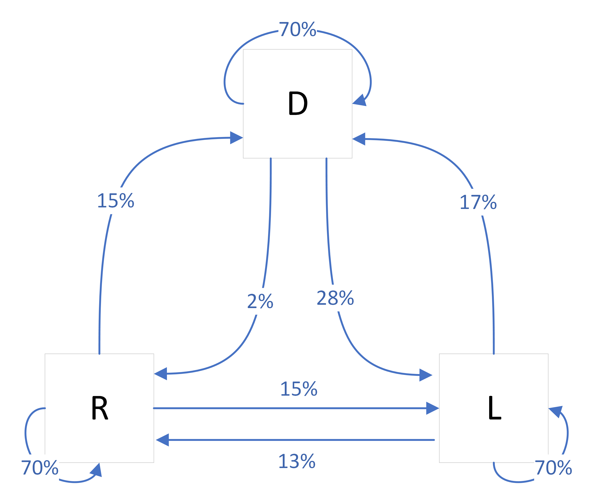

# Miniproject 1

## Overview 

In this miniproject you will learn about *Markov chains* and use them to make predictions about long term trends in population growth and car ownership. 

**Prerequisites**: You'll need to know how to multiply a matrix times a vector, both by hand and using SymPy. 

**Initial deadline**: *Fill in here later*. This is the deadline for all *first* drafts of your solution. If you turn in a good-faith effort at a complete and correct solution by this date, you may continue to revise and resubmit as needed with no additional deadlines, until the final deadline of 11:59pm ET Sunday April 16. However, no *first* drafts will be accepted after the initial deadline. 

## Background

Complete the following before beginning this miniproject. These are not to be turned in! But you won't get far on the assignment without doing them. 

- Read Section 1.3.1 (Markov chains: An application of matrix-vector multiplication) on pages 26--28 in the textbook and work through the examples shown. 
- If needed, [watch the tutorial video where I walk through Example 1.3.3](https://gvsu.hosted.panopto.com/Panopto/Pages/Viewer.aspx?id=97c3c6f8-d68e-461c-ac95-af72010dec46). This also shows how to use SymPy to do some of the math. 
- Practice with SymPy by using it to work Exercises 1-4 on page 29. 

## Assignment 

1. (Exercise 26) Suppose that for a large population that stays relatively constant (that is, there are no population explosions or mass migrations), people are classified as living in urban, suburban, or rural settings. Moreover, assume that the probabilities of the various possible transitions are given by the following rule: 

| Future location / current location | U (%) | S (%) | R (%) |
| ---------------------------------- | ----- | ----- | ----- |
| Urban                              | 92    | 3     | 2     |
| Suburban                           | 7     | 96    | 10    |
| Rural                              | 1     | 1     | 88    |

   (a) In plain English, what does the "10" in the table above mean? 

   (b) Let $U_n$, $S_n$, and $R_n$ represent the populations of people in urban, suburban, and rural areas respectively in year $n$ Write an equation that expresses $U_{n+1}$ in terms of $U_n$, $S_n$, and $R_n$. Then do the same for $S_{n+1}$ and $R_{n+1}$. 
   
   (c) Take the three equations from part (b) and convert them into a transition matrix $M$. Is this a stochastic matrix? Explain. 
   
   (d) Assume that the entire population is 250 million people, initially distributed into 100 million urban, 100 million suburban, and 50 million rural. With this assumption, predict the population distribution after 5, 10, and 25 years. 
   
   (e) As the number of years grows larger and larger, what appears to be happening to the population distribution? 

2. Three major political parties in the United States are the Democratic, Republican, and Libertarian parties.  Let $D_k$, $R_k$, and $L_k$ represent the percentage of voters voting for the Democratic, Republican, and Libertarian parties in election $k$. Over time, people sometimes switch their party affiliation when they vote. The diagram below shows a possible system of voter affiliation change: 

In this model, 70% of voters stay with the same party from one election to the next. But, for example, 15% of voters who vote Republican in one election will switch to vote Libertarian in the next. 

   (a) Write expressions for $D_{k+1}$, $R_{k+1}$, and $L_{k+1}$ in terms of $D_k$, $R_k$, and $L_k$ and briefly explain your reasoning. 

   (b) If we write $\mathbf{x}_k = \begin{bmatrix} D_k \\ R_k \\ L_k \end{bmatrix}$, find the matrix $A$ such that $\mathbf{x}_{k+1} = A \mathbf{x}_k$. 

   (c) Explain why $A$ is a stochastic matrix. 

   (d) Suppose that, initially, 45% of voters vote Democratic, 43% vote Republican, and the remainder vote Libertarian. Form the vector $\mathbf{x}_0$. Then, find $\mathbf{x}_1$, the percentage of voters who vote for the three parties in the next election. Summarize your results in a single sentence. 

   (e) Find $\mathbf{x}_4$, $\mathbf{x}_{8}$, and $\mathbf{x}_{12}$. Over time, what percentage of the vote should each party expect to get in an election? Explain your reasoning. 

## Submission and Grading

### Formatting and special items for grading

Please review the section on Miniprojects in the document [Standards For Student Work in MTH 302](https://github.com/RobertTalbert/linalg-diffeq/blob/main/course-docs/standards-for-student-work.md#standards-for-miniprojects) before attempting to write up your submission. Note that *all* Miniprojects: 

- **Must be typewritten**. If any portion of the submission has handwritten work or drawings, it will be marked *Incomplete* and returned without further comment. 
- **Must represent a good-faith effort at a complete, correct, clearly communicated, and professionally presented solution.** Omissions, partial work, work that is poorly organized or sloppily presented, or work that has numerous errors will be marked *Incomplete* and returned without further comment. 
- **Must include clear verbal explanations of your work when indicated, not just math or code**. You can tell when verbal explanations are required because the problems say something like "Explain your reasoning". 

Your work here is being evaluated *partially* on whether your math and code are correct; but just as much on whether your reasoning is correct and clearly expressed. Make sure to pay close attention to both. 

Miniproject 1 in particular **must be done in a Jupyter notebook using SymPy to carry out all mathematical calculations**. A sample notebook, demonstrating the solution to a Calculus problem, can be found here. Study this first before writing up your work. 

It's likely that writing up your Miniproject work in a Jupyter notebook will become standard practice for later Miniprojects. 
### How to submit

You will submit your work on Blackboard in the *Miniproject 1* folder under *Assignments > Miniprojects*. But you will *not* upload a PDF for Miniprojects. Instead you will **share a link that allows me (Talbert) to comment on your work**. [As explained in one of the Jupyter and Colab tutorials](https://gvsu.hosted.panopto.com/Panopto/Pages/Viewer.aspx?id=ef5c0e24-5c1d-437f-be05-af730108b6d8), the process goes like this: 

1. In the notebook, click "Share" in the upper right. 
2. **Do not share with me by entering my email.** Instead, go to *General Access*, and in the pulldown menu select "Anyone with the link", then set the permissions to "Commenter". 
3. Then click "Copy Link". 
4. **On Blackboard**, go to the *Assignments* area, then *Miniprojects*. Select Miniproject 1. 
5. Under **Assignment Submission**, where it says *Text Submission*, click "Write Submission".  
6. **Paste the link to your notebook in the text area that appears.** 
7. Then click "Submit" to submit your work. 

I will then evaluate your work using the link. Specific comments will be left on the notebook itself. General comments will be left on Blackboard. 
