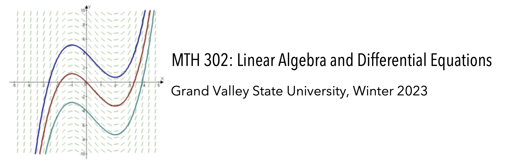
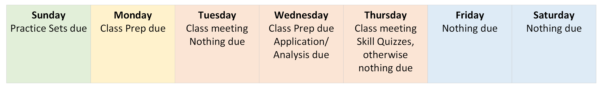

# MTH 302: Linear Algebra and Differential Equations

> All models are wrong, but some are useful. 
> 
> -- George Box

## About MTH 302 and this syllabus

**Welcome to MTH 302!** I'm Dr. Robert Talbert, the professor of this course. I'm grateful you're here, and I think you're going to love what you learn this semester. 

MTH 302 about **modeling and understanding systems undergoing change.** A car driving down a bumpy road is such a system, as it its shock absorbers encounter and smooth out the bumps. So is an ecosystem where one species preys upon another and the populations change dynamically. So is an electric circuit with a resistor and power supply; or two guitar strings vibrating next to each other at different frequencies; and many other systems we encounter every day. 

In MTH 302 we model and understand these systems using two fundamental tools: 

- **Linear algebra**, the study of systems of linear equations and their solutions; and 
- **Differential equations**, which studies equations that connect the current state of a quantity to its rates of change. 

Both tool sets are foundational in their own right. But as we will see, they can also mutually support each other in interesting and useful ways. 

**This syllabus contains all the information you need to navigate the course.** The main document will be kept continuously up to date at this link. When you see blue- or purple-underlined text in the syllabus or any other document, it's a clickable link. For example, [click here for a cat video](https://www.youtube.com/watch?v=aFuUidBR1aQ). A PDF version of the syllabus will also be available on Blackboard in the *Syllabus and Calendar* area, but it will not be updated unless there is a major change. 

**This document is meant to be read once, then searched as needed.** If you need to find something, the easiest way is to pull up this  document, hit `Control-F` and then do a search for the text you're looking for. 

All course materials for MTH 302 are available on GitHub at https://github.com/RobertTalbert/linalg-diffeq. Critically important documents (syllabus, etc.) will also be on Blackboard. 

## Course information 

- **Class meetings:** Section 03 meets TR 2:00-3:50 in EC 421. Section 04 meets TR 4:00-5:50 in EC 710. 
- **Instructor:** Robert Talbert, Ph.D., Professor of Mathematics. 
- **Office location:** MAK C-2-513 on the Allendale campus, but I will be using **EC 712C** for drop-in hours. 
- **Drop-in hours:** 12:30-1:50 TR in EC 712C. Please feel free to drop in during these times with any question you have. *No appointment is necessary!* These are in-person; if you need an online meeting during those hours, please go to https://calendly.com/robert-talbert/mth-302-online-visit-during-drop-in-hours. 
- **Appointments outside drop-in hours:** Available on a limited basis on Mondays and Wednesdays. Go to https://calendly.com/robert-talbert, choose a meeting type, then choose an open 20-minute time slot. 
- **Contacting the prof:** Email (talbertr@gvsu.edu) is preferred. Be sure to read the *Instructor availability and message responses* policy later in this syllabus.  
- **Course calendar:** The official course calendar is in Appendix B and on Blackboard. *In case of a date conflict on assignments or course documents, the Class Calendar is assumed to be correct.* 
- **Definition of "week":** In our course, a "week" is defined to begin at 12:01am ET on *Monday* and end at 11:59pm ET the following *Sunday*. 
- **Blackboard and announcements:** Our Blackboard page is at https://lms.gvsu.edu. Announcements will be posted on Sundays, with occasional mid-week announcements. *Be sure to check announcements, email, and the calendar at least once daily.*
- **Textbook:** *Differential Equations with Linear Algebra* by Boelkins, Goldberg, and Potter. It is freely available online through the GVSU Library; [click here to access](https://ebookcentral-proquest-com.ezproxy.gvsu.edu/lib/GVSU/detail.action?docID=472100). **I recommend you download individual PDFs of the chapters so you can use them offline.** We will be working through most of Chapters 1--5. 

**Course tools:** We will use computer tools extensively in the course. In addition to Blackboard, these include: 

- **Perusall** (http://perusall.com): An online tool for collaborative reading and viewing. 
- **Python**: A widely-used and easy to learn programming environment. We will not be doing much actual programming in the course, but instead using two packages for doing math: **SymPy** (a package for doing symbolic math) and **NumPy** (for numerical analysis). 
- **Jupyter notebooks** via **Google Colab** (http://colab.research.google.com): Jupyter is an open-source graphical notebook interface for working with Python. Colab is a Google product for working with Jupyter notebooks, that lives in the cloud and can be connected to your GVSU Google Drive. 
<!-- - **Miro** (http://miro.com): An online whiteboard tool for presentations and collaborative work. We'll use it in class from time to time.  -->

We'll get fluent with all of these tools during the first week of class. 

## How to succeed in MTH 302 

**My top prority as a professor at GVSU is your success**. In MTH 302, you can expect:

- A learning environment that challenges you, but also where support is readily available and freely given. This class is *a safe space to make mistakes*. 
- Work that is meaningful and not "busy work", and grading practices that prioritize growth and improvement. 
- Transparency and openness in how the course is run, including clear instructions on what you need to do and when. 
- Openness to your ideas about the course, with regular solicitations for feedback that are taken seriously through a continuous improvement process. 
- Above all, **respect** -- for you as a learner, as an adult, and as a human. 

On your end, your success in the course depends on three things: 

1. **Active engagement during class time**. The best way to learn is to be an active participant in the process. Students who approach the class with a passive mindset typically struggle, and often fail. But those who approach it with an active mindset, on the other hand, often surprise themselves with how much and how well they learn. Make it a priority not to just attend and take notes, but *get involved*. 
2. **Asking questions**. The material in MTH 302 can be challenging, and it is 100% certain you will be lost, confused, and/or stuck at times. **This is not a defect -- it means you're doing the course right.** When it happens, don't wait for things to make sense on their own: *Ask questions* of me and your classmates and take action to make sense of the material. 
3. **Good management of time, tasks, and information.** Understanding the material won't help you if you procrastinate, skip reading announcements, or don't use a calendar. All course information will be clearly laid out for you, but it's up to you to import that information into your own lives and act on it. 

If you can commit to these three things, then I have every expectation that you'll succeed in the course, no matter what your math background or perceived math skill is. 

## How MTH 302 is structured 

### Course level learning objectives and catalog description

**Official catalog description:** Matrix algebra and determinants. Introduction to the theory of differential equations. Methods of solution (including Laplace transform techniques) of linear equations, as well as some special types of nonlinear equations. Applications in physical, biological, and social sciences. Offered fall and winter semesters. *Prerequisite*: MTH 203. *Credits*: 4. 

After successful completion of the course, you will be able to…

1. Explain the geometric and physical significance of the concepts of linear algebra.
2. Apply linear algebra and differential equations to mathematical modeling.
3. Apply computational and analytical techniques to formulate, solve, and interpret mathematical models.
1. Apply quantitative methods to ordinary differential equations.
2. Use computer algebra systems such as Maple®, Matlab®, and/or Mathematica®.
3. Explain how concepts in linear algebra and differential equations can be generalized to different contexts.
7. Use modern computer tools (Python, specifically the SymPy and NumPy packages) to analyze and solve problems involving linear algebra and differential equations. 

### How MTH 302 is set up 

The course content is split up into four distinct modules: 

- **Linear algebra:** Systems of linear equations; row reduction and solving systems; linear combinations and span; linear independence; matrices and matrix algebra; inverses and determinants of matrices; eigenvalues and eigenvectors of matrices. 
- **Differental equations:** Basic terminology and concepts; slope fields; linear first-order DEs; nonlinear first-order DEs; Euler's method. 
- **Systems of differential equations:** Solving systems of DEs using eigenvalues; homogeneous first-order systems; systems with linearly independent eigenvectors; systems without linearly independent eigenvectors; nonhomogeneous systems. 
- **Further explorations:** Higher-order DEs and their connection to systems; Laplace transform methods. 

There are many sub-topics that you'll be learning and practicing throughout the course. However, there are eleven **Foundational Skills** that are essential for all students to master. These are listed in Appendix A, Foundational Skills. 

### The flow of a typical week 

While we meet only on Tuesdays and Thursdays, you're expected to work actively on the course throughout the week. You'll be working on activities *before*, *during* and *after* class meetings and these all are designed to work together. Specific kinds of assignments are given **in bold face** and are explained fully in the next section. 

- *Before each class:* You'll be asked to complete a **Class Prep** assignment where you'll do a combination of reading, video viewing, and other activities then answering basic questions about it. This way, you'll come to class ready to work, and we can keep lecturing in class to a minimum.
- *During class:* Class meetings will be focused on *answering questions* and *doing active work*. Much of this work will be turned in later as **Application and Analysis** assignments. We'll also sometimes use class meetings for assessment.  
- *In between classes:* You'll be working on the Class Prep for the next class meeting; completing **Practice Sets** on WeBWorK, a platform for doing online exercises; writing up the work you do in groups during class time to turn in Application and Analysis assignments; and completing **Miniprojects**. You can also use this time to come to drop-in hours or ask questions via email. 

Due dates on these assignments happen on a consistent schedule: 

- Practice Sets are always due at **11:59pm ET on Sundays**. 
- Class Preps are always due at **11:59pm ET on Mondays and Wednesdays** (the night before the class meeting).
- Application/Analysis sets are always due at **11:59pm ET on Wednesdays**. 

Visually, a typical week in MTH 302 looks like this: 

Due dates on Miniprojects vary; see below for details. 

---

## Assignments and grades

### Overall approach to grades in MTH 302

The way grades work in MTH 302 is different from what you might have experienced. In MTH 302: 

- **Almost none of your assignments have point values**. The ones that do have point values, are given either 0 or 1 points only. Therefore there is **no partial credit and no averaging**. 
- Instead, assignments have **specifications** which are descriptions of what constitutes "acceptable" work. These are given in detail in the document *Standards for Student Work* which you can find on Blackboard in the *Syllabus and Calendar* area. When you submit an assignment, I will read it carefully and compare it with the standards, and simply determine whether it meets the specifications or not. 
- After I evaluate your work, in most cases you will receive **detailed feedback** that will tell you whether your work meets the standards, and if not, the feedback will tell you what was missing and how you might go about fixing it. 
- Then, on almost every piece of work, you will have the chance to **retry** the assignment if needed, get more feedback, and repeat this **feedback loop** until the work meets our specifications. 
- Your course grade is not based on point totals or averages (because most items don't have point values). Instead, the course grade is based on **how many important learning tasks you've accomplished** by the end of the semester, using a simple table that's given below. 

This process, using specifications and feedback loops rather than points and averages, is how evaluation of work happens in most situations outside of college. In your future jobs, for example, you'll be reviewed regularly by your manager; it's not a "one and done" situation where you get a point score and then the process is over. Instead, in a real job, you get feedback and coaching on how to improve, and then you act on the feedback and show the boss that you have improved. 

Therefore grades in MTH 302 are based not on your ability to do good work at a single point in time, but rather on your ability to **eventually learn the material** by acting on feedback from previous attempts. 

I've been using this grading method since 2017, originally in MTH 325 and now in all my classes. We do things this way because **learning takes time**, and I believe grading your work based on a single point of data such as a quiz or test and then averaging all of those data is not only inaccurate, but statistically invalid and even unethical. Feedback loops are how all human learning takes place. So this seems like the best way to do grading. 

Those are the main concepts; the details are in the rest of the syllabus. Most students need a week or two to adapt to this system, but then everything is fine. I encourage you to ask questions at any time so I can help you. 

### How you will be assessed 

There are five major kinds of assignments in MTH 302: 

- **Practice Sets:** These are weekly practice exercises over the basic computations we learn. These are completed using WeBWorK, a platform for online homework. Typically 5-7 problems per week are assigned and are graded 1 point if the answer is correct and 0 points otherwise. 
- **Class Prep:** These are done prior to class and will give you the basic knowledge of terms, ideas, and basic concepts that will allow us to jump right into applications when we get to class. They involve reading portions of your textbook (and occasionally watching video), engaging in asking questions about what you read, and answering some simple questions about the content. 
- **Application and Analysis:** In class, we will work in groups on higher-level tasks involving application and analysis of the basics. You'll be responsible for individually completing this work that you start in groups during class, and turning it in to be checked for basic overall correctness. 
- **Skill Quizzes:** Each Thursday, we'll take time in class for a timed quiz over a subset of the eleven Foundational Skills found in Appendix A. Each skill will appear on *three consecutive quizzes* so you'll have three attempts at each. 
- **Miniprojects:** These are longer-form problems that involve deeper applications of the concepts from class, on applications in a variety of domains and in problems whose solutions require computer tools and good technical writing. 

Each of these assignments is graded as follows: 

| Assignment | Basis for grading | What's recorded on Blackboard | 
| :---------: |  :---------: |  :---------: | 
| Practice Sets | Correctness | Nothing; scores are kept on WeBWorK | 
| Class Prep | Completeness and effort only | *Success* or *Incomplete* | 
| Application/Analysis | Completeness and overall correctness | *Success*, *Retry*, or *Incomplete* | 
| Foundational Skills (via Skill Quizzes) | Overall correctness | *Success* or *Retry* | 
| Miniprojects |  Completeness, overall correctness, writing, and presentation | *Success*, *Retry*, or *Incomplete* | 

The document *Standards for Student Work* gives a complete description of the specific criteria used for grading these assignments.  

Additionally, we will have a brief but comprehensive **final exam**, graded using points (out of 100) whose schedule is on the course calendar. 

## Course grades 

Your course grade is assigned using the table below. Each row indicates the *minimum* number of "Successful" results needed to satisfy the requirement for that grade. (For example, earning a "B" requires nine (9) or more *Success* marks on Foundational Skill problems on skill quizzes.) To earn a grade, complete **all** the requirements listed in the row for that grade. The numbers in parentheses indicate the maximum number of the assignment that is planned; if any of those numbers changes during the semester, the grade table will be updated accordingly. 

| Grade | Total of Class Preps and Practice (100) | Application/Analysis (11) | Foundational Skills (11) | Miniprojects (8) |
|:-----:|:---------------------------------------:|:-------------------------:|:------------------:|:------------:|
|   A   |                   85                    |             9             |         10         |      5       |
|   B   |                   75                    |             7             |         9          |      3       |
|   C   |                   65                    |             5             |         8          |      1       |
|   D   |                   40                    |             2             |         4          |      0       |

A grade of "F" is assigned if not all of the requirements for a "D" are met. 

Note: Practice sets are graded using points; also, each *Success* mark on a Class Prep counts as one point. There are 24 Class Prep assignments planned, and at least 76 Practice exercises. 

**Plus/minus grades:** A "plus" is given on a letter grade if you satisfy all the requirements for that grade, *plus* one of the following:

- Earn an 85% or higher on the final exam, or 
- Complete two categories in the grade table for the next grade level up, not including Class Prep/Practice. 

A "minus" is given on a letter grade if you satisfy all the requirements for that grade, but one of the following is true: 

- You earn a 50% or lower on the final exam, or 
- You satisfy all the requirements for a grade except Class Prep/Practice. In this case, the exact amount by which the grade is lowered will be determined in a discussion between you and the professor; extremely low levels of Class Prep/Practice may warrant a larger penalty than a "minus". 

*Exceptions:* GVSU does not award grades of A+ or D-. 

To track your grade as the semester unfolds, you can use the *Course Grade Tracker* handout that is posted on Blackboard in the *Syllabus and Calendar* area. 

## Revisions and reattempts 

To encourage your participation in a feedback loop with your work, **you can revise or reattempt most assignments you turn in, without penalty, until it meets the criteria for acceptable work given in the *Standards for Student Work* document.** Not all work can be revised, and some work has limitations on revision. Here are the details: 

| Assignment | Revisions allowed | How to revise and resubmit | 
| :-------: | :----------------: | :-------------------------: | 
| Class Prep | *May not be revised.* | n/a | 
| Practice Sets | Problems can be retried as often as needed before the deadline. | Submit a new answer on WeBWorK. | 
| Application/Analysis | Application/Analysis sets may be revised **once per set**. | Submit a revision on Blackboard. | 
| Foundational Skills | Each skill appears on three consecutive quizzes. | Retry the skill on a subsequent quiz. | 
| Miniprojects | Up to **two revisions per week** of miniprojects may be submitted. | Submit a revision on Blackboard. | 

## Academic integrity and honesty 

**This course is subject to [GVSU course policies](http://www.gvsu.edu/coursepolicies/) and the [GVSU student code](https://www.gvsu.edu/cms4/asset/7B58A5E7-F4C2-114C-CCDA36F96BD2AF73/the_statement_final_fa2020(2).pdf). This document establishes guidelines and expands and clarifies these policies with respect to all work done in MTH 302 this semester.** 

The student code defines **academic misconduct** as *any action or behavior that misrepresents one’s contributions to or the results of any scholarly product submitted for credit, evaluation, or dissemination*. This includes cheating, collusion, dual submission, falsification, and plagiarism as well as any behavior that enables or helps others do these things.

Academic misconduct is a serious matter and carries significant consequences, up to and including failure of the course and possible suspension from the university. In all cases, the guidelines established in the GVSU catalog and GVSU student code will be followed. I reserve the right to discuss the nature and origins of any assignment with any student before assessing it.

Different assignments in MTH 302 have different levels of acceptable collaboration. These are detailed below. **It's your job to read these carefully, know what is acceptable and what is not acceptable on each kind of assignment, and stay within bounds.** 

- On *Class Prep*, you are **allowed and encouraged to collaborate with others** as long as your  responses reflect your own understanding and are not merely copied from another. Remember, these are only graded on completeness and effort, and mistakes are not penalized. 
- On *Practice Sets* and *Miniprojects*, you are **allowed to engage in general discussions of strategy only with others, but no collaboration on the details of a problem are allowed.** Practice Set problems use randomized elements to ensure that no two students receive the exact same problem. 
- On *Application/Analysis* sets, you **will work in groups during class time to start** on these sets but **they must be finished individually with no collaboration beyond what took place in class**. For example if you need to talk with one of your group members to clarify something they said during class, that is OK; but it is not OK to question that person further about work that didn't take place during class. 
- On *Skill Quizzes*, these are done in class and **no collaboration is allowed at all**. 

**Definition of "others" in these policies:** Collaboration with "others" includes current students in your section of MTH 302; students in other sections of MTH 302; former students from MTH 302; discussion-oriented websites like StackExchange or Reddit; and artificial intelligence applications such as ChatGPT. The intention here is that **the work you submit is your thinking, not someone else's.** 

There are two important exceptions to these rules: 

- *Technical* details about an assignment --- for example how to format an equation in Markdown, or getting general help on using Jupyter notebooks --- is fine to discuss in whatever level of detail you want with anyone else. 
- **You can ask me (Talbert) any question you want, about anything, at any time.** Getting help from the professor is not academic dishonesty! In case I cannot answer a question because it would reveal spoilers for the solution, I'll tell you so and it will be no big deal. 

PLEASE NOTE: **There's no need to be academically dishonest in MTH 302, because you can revise and resubmit.** Rather than cheat, *do your best, ask questions, and use the revision process* so that you really grow and learn in the course. 

## Getting help 

As mentioned, you will almost certainly find yourself lost, stuck, or confused on *something* in this course, possibly quite often. This is not a defect in your character or intelligence; it's a sign you are being challenged, and you can turn that challenge into real growth by **seeking out help as soon as you need it**. 

Make every effort to get yourself unstuck and resolve your questions on your own first. But then: 

* **On Practice Sets, click the "Email the instructor" link for personalized help on a problem**. This will draft an email to me where you can ask a question, and it includes a link to your most recent attempt at the problem. *Please use this link rather than sending a separate email.* 
* **Attend drop-in hours and ask questions there.** You can use the in-person drop-in hours, the online ones, or both. No appointment needed. 
* [Schedule an appointment through Calendly](https://calendly.com/robert-talbert/) if drop-in hours don't work for you. 
* **Work with a classmate** as long as you're staying within bounds on academic honesty above. In particular, working in groups on Class Prep is a very good idea and will help keep you from getting stuck at the beginning of a new concept. 

## Course Policies 

### Attendance, absence, and participation

- **Attendance** is expected at all class meetings and is required for working on Application/Analysis sets and Skill Quizzes. While attendance is not directly part of your grade, it will be recorded at each class meeting, so that I can reach out to students who are absent often. 
- **Remote attendance** (via live-streaming or recorded class meetings) is generally not offered in MTH 302. If you are in a situation where you believe you need a remote attendance option, please let me know as soon as possible; but please note I may not be able to accommodate you immediately. 
- **Absences** from class do not require permission from me or prior notification, although a heads-up is helpful. However: 
    - If you are absent, you will not have the benefit of working with your group on Application/Analysis; you will be expected to complete the set on your own. 
    - If you are absent from a Skill Quiz, no makeups are available, but the work is not due on Blackboard until 11:59pm ET that evening. Each Foundational Skill appears on three separate quizzes, so if you miss one and do not turn in the work that day, you'll be expected to make an attempt on the next quiz.

Exceptions to these rules are always up for discussion. If you believe you need special accommodation, please contact me as soon as possible to discuss it. 

### Inclement weather 

In case of a major weather event that makes in-person meeting inadvisable, **class will be moved online**. You'll be provided with links to the tools for doing this in case it becomes necessary. **Class will not be cancelled completely unless the university itself closes.** Make sure to check your email daily for announcements about changes to the class. 

### Deadlines and late work 

Assignments in MTH 302 follow a consistent schedule of deadlines: 

- Practice Sets are always due Sundays at 11:59pm ET. 
- Class Preps for a given class meeting are always due at 11:59pm ET the night before that meeting.
- Application/Analysis sets are always due Wednesdays at 11:59pm ET (on Blackboard). 
- Skill Quizzes are begun in class on Thursdays; if you don't complete in the time allowed, you may take until 11:59pm ET that evening to finish and upload your work. 

All deadlines are listed on the course calendar as well. 

Each miniproject comes with an **initial deadline**. Your **first attempt** on a miniproject must be submitted by that deadline, and no first attempts on a miniproject are accepted after that initial deadline. However, once your first attempt is submitted, there is **no deadline** for turning in revisions (if revisions are needed); you can continue to work with a miniproject at your own pace once the initial draft is turned in. However, **a single deadline of 11:59pm ET on Sunday, April 16** is in place for all work on Miniprojects. 

Revisions of Application/Analysis sets will also have deadlines, which will be announced in class. Revisions will typically be due one week after the original set is graded. 

### Deadline extensions

If you are working on an Application/Analysis set, Skill Quiz, or Miniproject, and need a little additional time to complete your work, you can extend the deadline by filling out the **Due Date Change Request Form** found in the Blackboard sidebar. You do not need approval; this form is simply informing me of when you plan on turning in the work. Please note, you may not get timely feedback on your work if you change the due date. If you ask for repeated extensions, I will likely reach out to see if we can find ways to help you keep up better. 

The reason we have such a liberal policy on deadlines is that this is how it works in the real world. In the real world, due dates and deadlines exist, but studies have shown that most of these are flexible, assigned mainly as a "commitment device" to help you stay motivated to complete the task. But, if you need more time to get the job done well, you email whoever set the deadline and ask if you can have some more time. Studies have shown[^1] that deadline extensions, when requested in moderation and when truly needed, can lead to better evaluation (and better work).

[^1]: "Go Ahead and Ask for More Time on that Deadline", https://hbr.org/2021/12/go-ahead-and-ask-for-more-time-on-that-deadline

However, please note, there are some **limitations on deadline extensions**: 

- **Deadlines for Class Prep and Practice Sets (WeBWorK) may not be extended**. Class Preps are time-sensitive and are only effective if completed before class. Skill Quizzes are done in class. Practice Sets have a week or more, with unlimited reattempts before completion; they also take a nontrivial amount of work to reset deadlines for individuals. 
- **Deadline extensions should be no more than 24 hours.** If you ask for something longer than that, you'll need to explain why, and I may ask you to turn it in sooner. 
- **Deadlines may not be extended twice on the same assignment**. Simply choose a reasonable deadline extension once, then abide by it. 
- The **final deadline for Miniprojects (11:59pm ET April 16) may not be extended**. 

### Technology skills and support 

You should be proficient in the basic technology skills listed at [this GVSU policy page](https://www.gvsu.edu/online/technology-requirements-for-onlinehybrid-courses-8.htm). This list is specifically for online and hybrid courses, but the skill set applies to our class as well. If you need help at any time with those skills, please ask me or a classmate. 

**I (Talbert) am not able to provide tech support** since I lack the skill and permissions to fix all possible problems. 

**Tech support:** Technology issues will happen with almost 100% certainty, usually at the worst possible moment. **When this happens, do NOT contact me first!** Instead, contact the appropriate person or office listed below: 

* For help with **Blackboard:** Email the Blackboard Help Desk at bbadmin@gvsu.edu or call (616)331-8526. For hours of operation and more information see http://www.gvsu.edu/elearn/help. 
* For help with **the GVSU network, email, or printing**: Email the GVSU IT Help Desk at helpdesk@gvsu.edu; or call (616)331-2101 or toll free (855)435-7488. For hours of operation and more information see https://www.gvsu.edu/it. 
* For help with **your computer:** Try the GVSU IT Help Desk (above) or contact your device's manufacturer or a computer store. 
* For help with **Perusall:** Contact **Perusall Help** at https://support.perusall.com. 
* For help with **any other technology:** Ask a question of a classmate (or me), seek out the help documentation in the tool you are using, or do a targeted Google search. 

**If technology issues prevent submitting work:** If you have contacted an appropriate source of help and an issue still persists that prevents you from turning in work in the usual way (for example on Blackboard), **you are expected to take alternative measures to get your work turned in on time.** For example, if Blackboard is offline and a deadline is near, send an email with an attachment. Then, submit the work using the normal means later. 

### Instructor availability and message responses

**You can ask a question about anything at any time.** You have both the right and the responsibility to ask questions about anything in the course you don't fully understand, whether math or some aspect of the syllabus or anything else. You can use email (talbert@gvsu.edu), drop-in hours, or grab me after class. Email is the best venue; to get help on a WeBWorK question, use the "Email the instructor" link found in the problem. 

However, please note that I do not always respond immediately to messages. In particular **I do not check email between 6:00pm and 6:00am on weeknights**, and **I do not check email at all on weekends**. That said, 

- Messages sent on a weekday (Monday-Friday) before 4:00pm ET will get a response *the same day*. 
- Messages sent after 4:00pm ET Monday-Thursday will get a response *the next day*. 
- Messages sent after 4:00pm on Fridays or on the weekend will get a response *the following Monday*. 

**Please plan ahead for instructor availability.** Some assignments are due on Sunday evenings; if you don't begin the assignment until Friday afternoon and encounter a question, you may not be able to get help from me in time. 

### Special accommodations and basic needs 

If you have special needs because of learning, physical or other disabilities, it is your responsibility to contact Disability Support Resources (DSR) at (616)331-2490 or http://www.gvsu.edu/dsr/. DSR will help you arrange accommodations. Then, speak with me in person about making those accommodations and ensure that they are consistent with your arrangements with DSR.

If you have difficulty affording groceries or accessing sufficient food to eat every day, or if you lack a safe and stable place to live, I encourage you to visit [Replenish](https://www.gvsu.edu/replenish/), a food resource for GVSU students. If you are comfortable doing so, please speak with me about your circumstances so that I can advocate for you and to connect you with other campus resources.

If, for purposes of gender identity and expression, your official name (in Banner) does not match your preferred name, your name can be updated in Blackboard. Please contact the registrar's office to submit this request. The registrar's office will contact the Blackboard administrator to make the change and will also contact your professors to inform them that your name in Banner will not match the name in Blackboard.

## About the instructor 

I'm Robert Talbert, the professor for this course. I'm a Professor of Mathematics and also work in the president's office as Presidential Fellow for the Advancement of Learning. This is my 31st year of teaching overall (not counting tutoring gigs). I have a Ph.D. in Mathematics from [Vanderbilt University](http://vanderbilt.edu) and a B.S. degree from [Tennessee Tech University](http://www.tntech.edu). 

I was, at best, a thoroughly mediocre math student in school until my senior year of high school, when I had a teacher for Calculus (hi, Mrs. Allen) who stopped trying to cram things into my head and instead showed me the basics -- and then backed off, and let me work things out on my own (with support if I got stuck). Basically, this is how I teach today. 

After a two-year gig as a Psychology major in college, I changed my major to math after a late-night dare from my roommate (long story) and, to my great surprise, I fell in love with the subject. I ended up getting a Ph.D. working in an obscure area at the intersection of abstract algebra and geometry, and I also discovered I loved teaching math to college students. So I went on to spend 14 years teaching in [small liberal arts colleges](http://franklincollege.edu) before coming to GVSU in 2011.

Now, I teach computer scientists and engineers how to think like mathematicians, I do research on how to make college teaching better, and I coordinate large-scale teaching/learning projects for President Mantella's office. When nobody is looking, I am working on my skills in Python and R, learning data science, and dabbling in project management. 

I live in Allendale with my wife, two teenage kids (there's another kid who lives in Greenville), and three cats. I'm a long-time bass guitar player and a lover of the outdoors. I aspire to spend more time in a kayak or on a bike than in front of a computer. You can read more about what I'm thinking and doing at my website, [rtalbert.org](https://rtalbert.org), or at my "other blog" [Grading for Growth](https://gradingforgrowth.com) about alternative grading practices which I co-author with my GVSU colleague Prof. David Clark. I'm also on Twitter at [@RobertTalbert](http://twitter.com/RobertTalbert) and on [LinkedIn](https://www.linkedin.com/in/roberttalbert/). I will accept any connection request on LinkedIn from a student! 

## Appendix A: Foundational Skills 

The following eleven skills are considered essential skills for competency in the course. Your course grade is partially determined by how many of these you can demonstrate mastery. The ones labelled "LA" are related to linear algebra; the ones labelled "DE" are related to differential equations. 

- LA.1: I can solve a system of linear equations by converting it into an augmented matrix and putting into reduced row echelon form. 
- LA.2: I can determine if a vector is in the span of a collection of other vectors. 
- LA.3: I can determine if a collection of vectors is linearly independent. 
- LA.4: I can add, subtract, and multiply matrices. 
- LA.5: I can determine if a matrix is invertible, using information about the matrix. 
- LA.6: I can find the eigenvalues and eigenvectors of a $2 \times 2$ and $3 \times 3$ matrix. 
- DE.1: I can solve a linear, homogeneous first-order differential equation using integration. 
- DE.2: I can solve a separable first-order differential equation using integration. 
- DE.3: I can generate a numerical solution to a first-order differential equation using Euler's method. 
- DE.4: I can solve a linear system of two differential equations. 
- DE.5: I can solve a linear, homogeneous second-order differential equation. 
<!-- - DE.6: I can compute basic Laplace transforms.   -->

## Appendix B: Course Calendar 

You can access the calendar directly at this link: https://calendar.google.com/calendar/u/1?cid=Y183MGRiN2ExZjIyNzc0OTYxOTEwY2IxN2ZlNzRhZjBjMDNhNzg3NDY5YjhlMzNiYWE0OGNhYzNlNTZjMjNhNDAwQGdyb3VwLmNhbGVuZGFyLmdvb2dsZS5jb20  It's also embedded on Blackboard in the *Syllabus and Calendar* area, as well as below (although some web versions may not display it). 

<iframe src="https://calendar.google.com/calendar/embed?src=c_70db7a1f22774961910cb17fe74af0c03a787469b8e33baa48cac3e56c23a400%40group.calendar.google.com&ctz=America%2FNew_York" style="border: 0" width="800" height="600" frameborder="0" scrolling="no"></iframe>

**Important dates:**

- Tuesday, January 24 and Thursday, January 26: No class, Prof. Talbert out of town
- Monday, March 6--Friday, March 10: Spring Break
- Thursday, April 21: Last class meeting

## Appendix C: Course Tools and Links

- **Blackboard**: http://lms.gvsu.edu, then look for your section of MTH 302. 
- **Google Colab:** This is our platform for using Python to do linear algebra and differential equations. Go to https://colab.research.google.com/ and sign in with your GVSU Google account. 
- **Perusall**: This is for doing reading and other activities for  http://perusall.com (Use the invite code posted to Blackboard in the *Important Links* area; log in to access course materials) 
- **Calendly**: This is for scheduling appointments with me outside of the usual drop-in hours. Go to https://calendly.com/robert-talbert then choose the kind of appointment you want, then pick any open 20-minute time slot. Note, appointment slots are limited. 